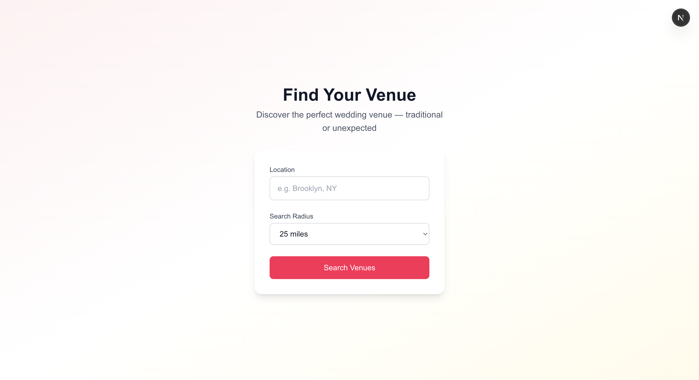
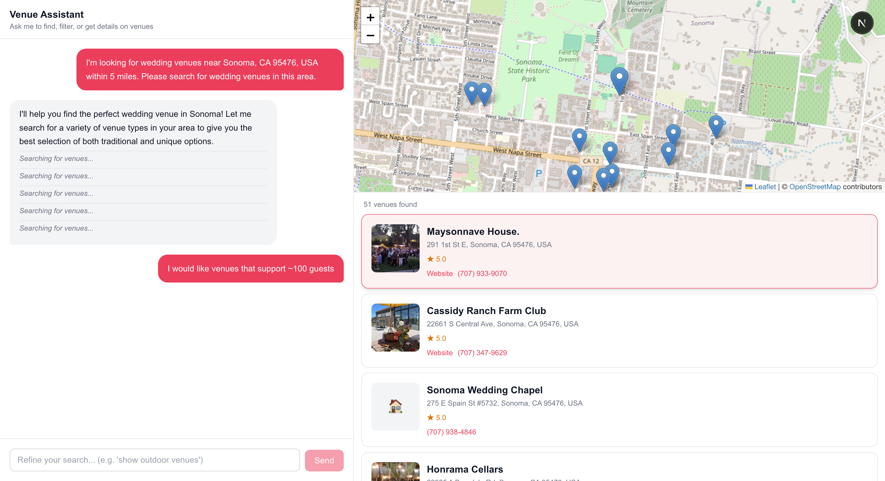

# wedding-venue-agent

An agentic-based system that specializes in finding typical and atypical wedding venues in a given region

This project is an opportunity to practice building software with LLMs, 
like Claude Code and Google's AI Studio.

## How does it work?

### Landing Page
Enter a location and search radius to begin your venue search.

### Venue Assistant
An interactive AI assistant helps you find venues, displays them on a map, and lets you refine your search with follow-up messages.

